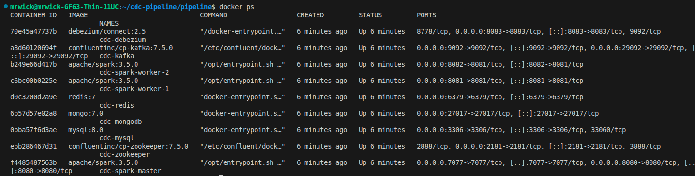
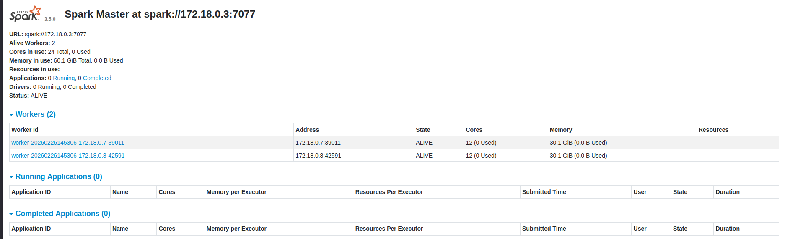
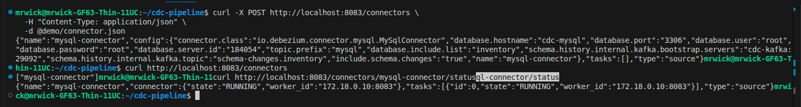
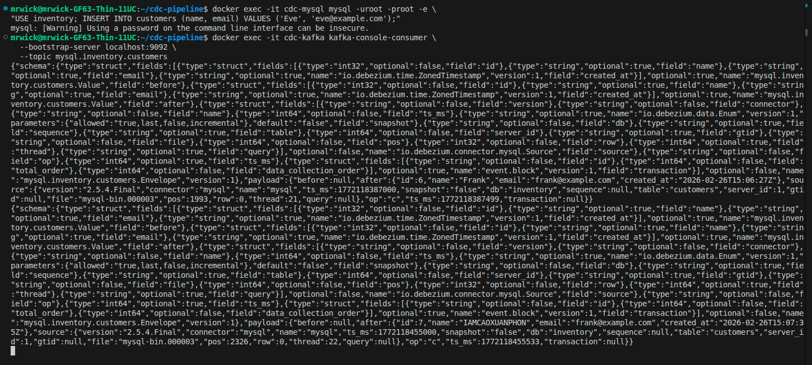
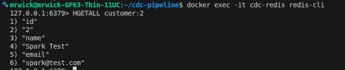

# CDC Real-time Data Pipeline

> **Đồ án tốt nghiệp (DATN)** — Hệ thống đồng bộ dữ liệu real-time sử dụng Change Data Capture (CDC).
> Tự động phát hiện mọi thay đổi trong MySQL và truyền đến MongoDB + Redis trong vòng ~3 giây, không cần sửa code ứng dụng.

---

## Mục lục

1. [Vấn đề giải quyết](#1-vấn-đề-giải-quyết)
2. [Kiến trúc tổng quan](#2-kiến-trúc-tổng-quan)
3. [Cách hoạt động — từng bước](#3-cách-hoạt-động--từng-bước)
4. [Công nghệ sử dụng](#4-công-nghệ-sử-dụng)
5. [Kết quả đo lường](#5-kết-quả-đo-lường)
6. [Cài đặt và chạy](#6-cài-đặt-và-chạy)
7. [Giao diện và monitoring](#7-giao-diện-và-monitoring)
8. [Giới hạn hiện tại](#8-giới-hạn-hiện-tại)
9. [Cấu trúc thư mục](#9-cấu-trúc-thư-mục)

---

## 1. Vấn đề giải quyết

### Bối cảnh

Trong hệ thống thực tế, dữ liệu thường nằm ở nhiều nơi:

- **MySQL** — database gốc, nơi ứng dụng ghi vào
- **MongoDB** — để truy vấn linh hoạt, analytics
- **Redis** — cache tốc độ cao, tra cứu nhanh

**Vấn đề:** Khi MySQL có thay đổi (INSERT / UPDATE / DELETE), làm sao để MongoDB và Redis cập nhật theo *ngay lập tức* mà không phải viết code đặc biệt trong từng ứng dụng?

### Giải pháp truyền thống (và tại sao không dùng)

| Phương pháp | Vấn đề |
|---|---|
| Application ghi song song vào cả 3 DB | Code phức tạp, khó maintain, dễ mất đồng bộ khi lỗi |
| Cron job query MySQL định kỳ | Không real-time, tạo load trên MySQL, khó detect DELETE |
| Trigger trong MySQL | Vendor lock-in, khó test, không scale |

### Giải pháp CDC (Change Data Capture)

**Ý tưởng:** MySQL đã ghi lại *tất cả thay đổi* vào **binlog** (transaction log) — một file log nội bộ để MySQL dùng cho replication. Thay vì query MySQL, ta *đọc binlog* như một người quan sát thầm lặng, không ảnh hưởng gì đến hiệu năng MySQL.

```
MySQL viết dữ liệu → MySQL tự ghi vào binlog → Debezium đọc binlog
```

Project này implement toàn bộ flow đó: đọc binlog → truyền qua Kafka → Spark xử lý → ghi vào MongoDB + Redis.

---

## 2. Kiến trúc tổng quan

```
┌─────────────────────────────────────────────────────────────────────┐
│                         DATA SOURCES                                │
│                                                                     │
│   ┌─────────────────────────────────────────────────────┐          │
│   │  MySQL 8.0  (port 3306)                             │          │
│   │  ┌──────────────┐  ┌──────────────┐                │          │
│   │  │  customers   │  │   orders     │                │          │
│   │  └──────────────┘  └──────────────┘                │          │
│   └──────────────────────┬──────────────────────────────┘          │
│                          │ binlog (transaction log)                 │
└──────────────────────────┼──────────────────────────────────────────┘
                           │
                           ▼
┌─────────────────────────────────────────────────────────────────────┐
│                      CAPTURE & TRANSPORT                            │
│                                                                     │
│   ┌─────────────────────┐        ┌──────────────────────────────┐  │
│   │  Debezium 2.5       │        │  Apache Kafka (Confluent 7.5)│  │
│   │  (CDC Connector)    │──────► │  Topics:                     │  │
│   │  Đọc binlog MySQL   │ events │  · inventory.inventory.      │  │
│   │  Không query DB     │        │    customers                 │  │
│   └─────────────────────┘        │  · inventory.inventory.      │  │
│                                  │    orders                    │  │
│                                  └──────────────┬───────────────┘  │
└─────────────────────────────────────────────────┼───────────────────┘
                                                  │
                                                  ▼
┌─────────────────────────────────────────────────────────────────────┐
│                        STREAM PROCESSING                            │
│                                                                     │
│   ┌──────────────────────────────────────────────────────────────┐  │
│   │  Apache Spark 3.5.0 — Structured Streaming                  │  │
│   │  ┌────────────┐  ┌────────────┐  ┌────────────┐            │  │
│   │  │  Master    │  │  Worker 1  │  │  Worker 2  │  Worker 3  │  │
│   │  │  (8080)    │  │  4 cores   │  │  4 cores   │  4 cores   │  │
│   │  └────────────┘  └────────────┘  └────────────┘            │  │
│   │  Scala JAR — Trigger 5s — Exactly-once semantics           │  │
│   │  · Parse JSON event từ Kafka                               │  │
│   │  · Mask email (privacy)                                    │  │
│   │  · Decode Debezium decimal format                          │  │
│   │  · Route theo bảng (customers / orders)                    │  │
│   └───────────────────────┬──────────────────────────────────────┘  │
└───────────────────────────┼─────────────────────────────────────────┘
                            │
              ┌─────────────┴─────────────┐
              ▼                           ▼
┌─────────────────────┐     ┌─────────────────────────────────┐
│   MongoDB 7.0       │     │   Redis 7                        │
│   (port 27017)      │     │   (port 6379)                   │
│                     │     │                                  │
│  db: inventory      │     │  customer:{id}  → Hash (fields) │
│  · customers        │     │  customers:total → Counter       │
│  · orders           │     │  orders:{id}    → Hash           │
│                     │     │  orders:revenue → Sorted set     │
│  Idempotent upsert  │     │  spark:batch_duration_ms → str  │
│  replaceOne+upsert  │     │                                  │
└─────────────────────┘     └─────────────────────────────────┘
              │                           │
              └─────────────┬─────────────┘
                            │
┌───────────────────────────▼─────────────────────────────────────────┐
│                         MONITORING                                  │
│                                                                     │
│   ┌──────────────────────┐  scrape/5s  ┌────────────────────┐      │
│   │  metrics_exporter    │ ──────────► │  Prometheus :9090  │      │
│   │  Python :8000        │             └────────┬───────────┘      │
│   │  35+ custom metrics  │                      │                   │
│   │  Đọc MySQL/Mongo/    │             ┌────────▼───────────┐      │
│   │  Redis/Kafka/Spark   │             │  Grafana :3000     │      │
│   └──────────────────────┘             │  Dashboard +       │      │
│                                        │  Alert rules       │      │
│                                        └────────────────────┘      │
└─────────────────────────────────────────────────────────────────────┘
```

**Tóm tắt luồng dữ liệu:**
```
MySQL INSERT/UPDATE/DELETE
  → Debezium đọc binlog (không load MySQL)
  → Kafka lưu tạm (persistent, không mất data)
  → Spark đọc mỗi 5s, xử lý batch
  → MongoDB (lưu trữ) + Redis (cache)
  → Prometheus scrape metrics → Grafana hiển thị
```

---

## 3. Cách hoạt động — từng bước

### Ví dụ cụ thể: Thêm khách hàng mới

**Bước 1 — Ứng dụng INSERT vào MySQL:**
```sql
INSERT INTO inventory.customers (name, email, phone)
VALUES ('Nguyễn Văn A', 'nguyenvana@gmail.com', '0901234567');
-- → MySQL ghi vào binlog: {op: "c", after: {id:1, name:"Nguyễn Văn A", ...}}
```

**Bước 2 — Debezium phát hiện (< 1s):**
Debezium đang "theo dõi" binlog như tail -f. Khi có entry mới, nó tạo ra một JSON message:
```json
{
  "op": "c",
  "source": {"table": "customers"},
  "after": {"id": 1, "name": "Nguyễn Văn A", "email": "nguyenvana@gmail.com"}
}
```
Đẩy vào Kafka topic `inventory.inventory.customers`.

**Bước 3 — Kafka lưu trữ bền vững:**
Message nằm trong Kafka cho đến khi Spark đọc. Nếu Spark đang bận hoặc restart, message không mất.

**Bước 4 — Spark xử lý (mỗi 5s):**
Spark đọc tất cả messages tích lũy, xử lý song song trên 3 workers:
- Parse JSON, đọc trường `op` để biết là INSERT/UPDATE/DELETE
- Mask email: `nguyenvana@gmail.com` → `n*********a@gmail.com` (bảo vệ privacy)
- Ghi vào MongoDB: `replaceOne({id:1}, {...}, upsert=true)` — idempotent
- Ghi vào Redis: `HSET customer:1 name "Nguyễn Văn A" email "n*...*a@gmail.com"`
- Tăng counter: `INCR customers:total`

**Bước 5 — Kết quả (~3 giây sau INSERT):**
```
MongoDB: db.customers.findOne({id:1}) → document đầy đủ
Redis:   HGET customer:1 name → "Nguyễn Văn A"
Redis:   GET customers:total  → "1"
```

### Xử lý DELETE
```
MySQL DELETE → Debezium: {op: "d", before: {id:1, ...}}
Spark → MongoDB: deleteOne({id:1})
      → Redis: DEL customer:1 + DECR customers:total
```

### Xử lý UPDATE
```
MySQL UPDATE → Debezium: {op: "u", before: {...}, after: {...}}
Spark → MongoDB: replaceOne({id:1}, after_data, upsert=true)
      → Redis: HSET customer:1 ... (ghi đè, không đổi counter)
```

---

## 4. Công nghệ sử dụng

### Bảng tổng hợp

| Thành phần | Phiên bản | Vai trò | Lý do chọn |
|---|---|---|---|
| **MySQL** | 8.0 | Source DB | Hỗ trợ binlog row-based replication — điều kiện tiên quyết cho CDC |
| **Debezium** | 2.5 | CDC Connector | Chuẩn công nghiệp cho MySQL CDC, chạy trên Kafka Connect |
| **Apache Kafka** | Confluent 7.5.0 | Message broker | Durable, ordered, replay được — đảm bảo không mất event |
| **Apache Spark** | 3.5.0 | Stream processor | Exactly-once semantics, scale ngang, Scala JAR nhanh hơn PySpark |
| **MongoDB** | 7.0 | Sink (lưu trữ) | Schema flexible — phù hợp lưu CDC events có cấu trúc thay đổi |
| **Redis** | 7 | Sink (cache) | Sub-millisecond read — lý tưởng cho use case cache khách hàng |
| **Prometheus** | latest | Metrics collector | Pull-based, tích hợp sẵn với Grafana |
| **Grafana** | latest | Dashboard | Visualization + alert rules |
| **Docker Compose** | v2 | Orchestration | Chạy 13 containers với 1 lệnh |

### Chi tiết từng thành phần

#### MySQL — Source
- Binlog ở mode `ROW` — ghi lại từng row thay đổi thay vì SQL statement
- Debezium kết nối bằng MySQL replication protocol (không phải JDBC query)
- Tables theo dõi: `inventory.customers`, `inventory.orders`

#### Debezium — CDC Engine
- Chạy như một Kafka Connect plugin (không phải standalone)
- **Snapshot mode `initial`**: khi connector khởi động lần đầu, đọc toàn bộ data hiện có (op=`r`), sau đó switch sang streaming binlog (op=`c`/`u`/`d`)
- Produce JSON với schema: `{op, source, before, after, ts_ms}`
- Debezium op codes: `c`=INSERT, `r`=snapshot, `u`=UPDATE, `d`=DELETE

#### Kafka — Buffer & Transport
- Topics tự động tạo khi connector khởi động: `inventory.inventory.customers`, `inventory.inventory.orders`
- Hiện tại: 1 partition (default). Có thể tăng lên để scale throughput
- Retention mặc định: 7 ngày — có thể replay lại toàn bộ lịch sử

#### Spark — Processing Core
- **Scala JAR** (`CdcRedisConsumer`) — compiled, không có Python overhead
- **Structured Streaming** với trigger 5 giây — xử lý micro-batch
- **Checkpoint** tại `/tmp/spark-checkpoint/cdc-pipeline` — tự resume sau crash
- **Exactly-once**: Spark + MongoDB upsert idempotent = không duplicate, không mất record
- **Xử lý song song**: 3 workers × 4 cores = 12 cores tổng

#### MongoDB — Primary Sink
- Lưu customers và orders dưới dạng documents
- `replaceOne({id: X}, data, upsert=true)` — nếu chạy lại cùng event, kết quả giống nhau (idempotent)
- Cho phép query linh hoạt, aggregate, tìm kiếm full-text sau này

#### Redis — Cache Sink
- `customer:{id}` → Hash với tất cả fields (name, email, phone...)
- `customers:total` → Counter (tăng khi INSERT, giảm khi DELETE, không đổi khi UPDATE)
- `orders:revenue` → Sorted set theo revenue
- `spark:batch_duration_ms` → String, Spark ghi sau mỗi batch (dùng cho monitoring)

#### Metrics Exporter — Custom Prometheus Exporter
- Python service đọc MySQL, MongoDB, Redis, Kafka, Spark mỗi 5 giây
- Expose 35+ metrics tại `:8000/metrics`
- **Quan trọng**: Đây là baked Docker image — khi sửa `metrics_exporter.py` phải rebuild image, không chỉ restart container

---

## 5. Kết quả đo lường

### Môi trường test

| | |
|---|---|
| CPU | Intel Core i5-11400H @ 2.70GHz (6 cores / 12 threads) |
| RAM | 16 GB |
| OS | Windows 10 + Docker Desktop (WSL2 backend) |
| Spark | 3 workers × 4 cores × 2GB = 12 cores / 6GB |
| Kafka | 1 partition |
| Spark engine | **Scala JAR** (primary) |

### Throughput theo mức tải

| Mức inject | Inject thực | **E2E Throughput** | Spark p50 | Spark p95 | Lag |
|---|---|---|---|---|---|
| 100 rec/s | 99.8 rec/s | **92.7 rec/s** | 672 ms | 1,248 ms | 0 |
| 200 rec/s | 199.5 rec/s | **149.9 rec/s** | 669 ms | 1,088 ms | 0 |
| 500 rec/s | 497.1 rec/s | **404.3 rec/s** | 770 ms | 1,362 ms | 0 |
| Sustained 323/s × 30s | — | **273.3 rec/s** | 923 ms | 2,363 ms | 0 |

**E2E Throughput** = số records đến MongoDB ÷ (thời gian inject + thời gian drain hết lag).

### Điểm nổi bật

- **Smoke test: 43/43 PASS** — toàn bộ pipeline, monitoring, sync đều hoạt động
- **Latency ~3 giây** — từ MySQL INSERT đến MongoDB document xuất hiện
- **Kafka lag = 0** ở mọi mức test — Spark theo kịp real-time
- **Scala nhanh hơn PySpark ~4.9×** (404 vs 83 rec/s max)
- **Không bottleneck** phát hiện ở bất kỳ mức nào trong quick mode

### Lưu ý khi đọc con số

Các số trên đo trên localhost Docker — mọi service cùng máy nên network latency = ~0ms. Trong môi trường distributed thật (multi-server, cross-datacenter), throughput sẽ thấp hơn do network latency thật. Con số này phản ánh đúng *ceiling của setup single-node localhost*, không phải throughput production.

> Chi tiết phương pháp đo và so sánh lịch sử: [docs/BENCHMARK_RESULTS.md](docs/BENCHMARK_RESULTS.md)

---

## 6. Cài đặt và chạy

### Yêu cầu duy nhất

**Docker Desktop** (không cần cài Python, Java, Scala hay bất cứ thứ gì khác).

| | Tối thiểu |
|---|---|
| Docker Desktop | 24.0+ (kèm Compose v2) |
| RAM trống cho Docker | 12 GB |
| Disk | 10 GB |
| OS | Windows 10/11, macOS, Linux |

> **Windows:** Chạy tất cả lệnh `.sh` trong **Git Bash** (cài cùng [Git for Windows](https://git-scm.com/download/win)).
> PowerShell sẽ không hoạt động — `curl` trong PowerShell là alias khác.

### Chạy lần đầu

```bash
# 1. Clone repo
git clone <repo-url>
cd cdc-data-pipeline

# 2. Pull images (~5 phút, chỉ lần đầu)
docker compose pull

# 3. Khởi động toàn bộ pipeline
bash start.sh
```

Chờ **3–5 phút**. Script tự động:
- Detect hardware → chọn profile phù hợp (laptop/server/vm)
- Khởi động 13 containers theo đúng thứ tự
- Đăng ký Debezium connector
- Chờ Kafka topics tạo xong
- Submit Spark job (Scala JAR)
- Chờ Spark xử lý batch đầu tiên
- Restart Grafana để fix datasource UID

### Kiểm tra pipeline hoạt động

```bash
bash scripts/test_smoke.sh
# Kết quả mong đợi: 43/43 PASS
```

### Dừng pipeline

```bash
bash stop.sh          # Dừng, giữ data
bash stop.sh -v       # Dừng + xóa hết data (reset hoàn toàn)
```

### Chạy benchmark

```bash
bash scripts/run_bench.sh           # Quick mode (~3 phút)
bash scripts/run_bench.sh full      # Full mode (~10 phút)
python benchmark/compare_runs.py -n 5   # So sánh 5 runs gần nhất
```

### Live Demo Dashboard

```bash
pip install -r demo/requirements.txt    # Một lần duy nhất
bash demo/run_demo.sh
# Mở: http://localhost:8888
```
Bấm **▶ START DEMO** → chọn rate → xem dữ liệu cập nhật real-time mỗi 2s.

---

## 7. Giao diện và monitoring

| URL | Mô tả | Tài khoản |
|---|---|---|
| http://localhost:3000 | **Grafana** — dashboard chính (metrics, alerts) | `admin / admin` |
| http://localhost:8888 | **Live Demo** — interactive, bấm nút, xem real-time | — |
| http://localhost:8080 | Spark Master UI — active jobs, workers, executors | — |
| http://localhost:9090 | Prometheus — query metrics thô | — |
| http://localhost:8083 | Debezium REST API — connector status | — |
| http://localhost:8000/metrics | Metrics Exporter — Prometheus format | — |

### Grafana Dashboard

Dashboard chính (`uid: cdc-pipeline-main`) gồm các panels:
- **Records count**: MySQL / MongoDB / Redis so sánh real-time
- **Throughput rate**: insert_rate, kafka_rate, mongo_write_rate (records/s)
- **Kafka lag**: số messages tồn đọng chưa xử lý
- **Spark batch duration**: thời gian xử lý mỗi micro-batch (ms)
- **Spark executor**: cores và memory đang dùng
- **Alert rules**: lag ≥ 100 (warning), lag ≥ 500 (critical), batch ≥ 5000ms (warning)

### Screenshots

**Pipeline chạy đầy đủ — 12 containers healthy:**


**Spark Master UI — active streaming job:**


**Debezium connector RUNNING:**


**Kafka CDC event — INSERT:**


**Redis — customer data sau CDC:**


---

## 8. Giới hạn hiện tại

### Giới hạn kỹ thuật (đã biết, chưa fix hoặc chủ ý để đơn giản)

| # | Giới hạn | Ảnh hưởng | Cách mở rộng |
|---|---|---|---|
| **8.1** | Kafka chỉ 1 partition (default) | Throughput bị giới hạn bởi 1 consumer | Tăng lên 3 partition: `bash start.sh --partitions=3` |
| **8.2** | Kafka 1 broker, không replication | Không fault-tolerant — Kafka chết là mất data | Thêm 2 broker nữa, `replication.factor=3` |
| **8.3** | Spark checkpoint ở `/tmp` trong container | Mất checkpoint khi container bị xóa volume | Mount checkpoint ra host volume |
| **8.4** | `ram_gb = 0` trong benchmark JSON | Metadata sai, không ảnh hưởng throughput | Docker API để đọc host RAM |
| **8.5** | Benchmark inject single-threaded | Không test concurrent load | Multi-thread producer: `ThreadPoolExecutor` |
| **8.6** | ✅ Latency per-record đã đo được | `measure_e2e_latency()` trong benchmark: insert 1 probe → poll MongoDB → P50/P95/P99 | — |
| **8.7** | Không có Schema Registry | Dùng JSON thuần — nếu schema đổi, Spark cần update code | Kafka Schema Registry + Avro serialization |
| **8.8** | Không có TLS/auth cho Kafka và MongoDB | Phù hợp dev/test, không phù hợp production | SASL/SSL cho Kafka, auth cho MongoDB |
| **8.9** | Demo server chạy trên host, không trong Docker | Phụ thuộc Python host environment | Dockerize demo server |
| **8.10** | Sustained benchmark tối đa vài phút | Chưa test memory leak hoặc throughput drift | Chạy 8h+ liên tục |

### Giới hạn của hướng tiếp cận CDC tổng quát

| # | Giới hạn | Giải thích |
|---|---|---|
| **8.11** | MySQL binlog phải ở mode `ROW` | Mode `STATEMENT` không đủ chi tiết cho CDC. Cần DBA bật setting này |
| **8.12** | Latency tối thiểu = Spark trigger interval (5s) | Spark Structured Streaming là micro-batch, không phải record-by-record streaming thật. Worst-case latency = 5s |
| **8.13** | Debezium snapshot khi connector restart | Mỗi lần connector bị xóa, nó đọc lại toàn bộ MySQL (snapshot). Với DB lớn, bước này chậm |
| **8.14** | Thứ tự event chỉ đảm bảo trong cùng partition | Nếu dùng nhiều partition, events của cùng 1 row có thể xử lý không theo thứ tự |
| **8.15** | DELETE trong CDC không có "after" data | `op=d` chỉ có `before`, không có `after`. Nếu cần audit trail của deleted record, phải lưu `before` vào archive |

### Tính năng chưa implement

| # | Tính năng | Ghi chú |
|---|---|---|
| **8.16** | Kafka partition scaling test | Benchmark `partition` mode đã có trong code, chưa chạy thực tế |
| **8.17** | Benchmark trên cloud VM | `docs/VM_SETUP.md` có hướng dẫn, chưa thực thi |
| **8.18** | Thêm bảng thứ 3+ vào CDC | Pipeline đã hỗ trợ multi-table về mặt kỹ thuật, chỉ cần thêm vào `table.include.list` trong connector config |
| **8.19** | Per-record latency measurement | Cần thêm timestamp vào MySQL schema và propagate qua pipeline |
| **8.20** | Rebuild Scala JAR khi sửa source | Cần `sbt` + Java 11+ trên host. Pre-built JAR đã có sẵn trong repo |

---

## 9. Cấu trúc thư mục

```
cdc-data-pipeline/
│
├── 📄 docker-compose.yml          # 13 containers — toàn bộ stack
├── 🚀 start.sh                    # Khởi động pipeline (~3-5 phút)
├── 🛑 stop.sh                     # Dừng pipeline [-v để xóa data]
│
├── 📁 config/
│   ├── .env.laptop                # Config cho laptop (≤16GB RAM)
│   ├── .env.server                # Config cho workstation (≥32GB RAM)
│   └── .env.vm                   # Config cho cloud VM
│
├── 📁 scripts/
│   ├── test_smoke.sh              # Smoke test 43 checks
│   ├── run_bench.sh               # Chạy benchmark [quick|full|stress]
│   ├── run_scale_test.sh          # Ma trận scaling test (workers × partitions)
│   └── vm/
│       ├── vm_run.sh              # All-in-one launcher cho VM
│       └── vm_setup.sh            # Cài đặt môi trường VM mới
│
├── 📁 jobs/
│   ├── cdc-mysql-to-mongodb-redis_2.12-1.0.jar  ← Scala JAR đã build sẵn
│   ├── scala/cdc_redis_consumer.scala             ← Source code Scala
│   └── python/cdc_pipeline.py                     ← PySpark fallback
│
├── 📁 demo/
│   ├── demo_server.py             # Flask backend (:8888)
│   ├── index.html                 # Dashboard UI (Chart.js, dark theme)
│   ├── run_demo.sh / run_demo.bat # Launcher
│   ├── requirements.txt           # Python dependencies cho host
│   ├── .env.example               # Template config (copy → .env)
│   └── config/
│       ├── connector.json         # Debezium connector config
│       ├── init.sql               # MySQL schema khởi tạo
│       └── demodata.sql           # Sample data
│
├── 📁 monitoring/
│   ├── exporter/
│   │   └── metrics_exporter.py    # Custom Prometheus exporter (baked image)
│   ├── prometheus.yml             # Prometheus scrape config
│   └── grafana/
│       ├── dashboards/
│       │   └── cdc_fixed1.json    # Dashboard chính (uid: cdc-pipeline-main)
│       └── provisioning/
│           ├── datasources/       # Prometheus datasource auto-provision
│           └── alerting/
│               └── cdc_alerts.yml # Alert rules (lag, batch duration)
│
├── 📁 benchmark/
│   ├── run_benchmark_v4.py        # Benchmark engine (quick/full/stress/realistic)
│   ├── compare_runs.py            # So sánh nhiều lần chạy
│   └── results/
│       ├── history.jsonl          # Lịch sử tất cả runs (không gitignore)
│       └── latest_benchmark.json  # Kết quả lần chạy gần nhất
│
└── 📁 docs/
    ├── BENCHMARK_RESULTS.md       # Kết quả đo lường chi tiết
    ├── CLARIFICATIONS.md          # Giải thích khái niệm (TPS, records/s, drain...)
    ├── DEMO_SCRIPT.md             # Kịch bản demo cho hội đồng
    ├── LESSONS_LEARNED.md         # Các vấn đề thực tế gặp phải và cách fix
    ├── KNOWN_ISSUES.md            # Vấn đề đã biết + trạng thái
    ├── SPARK_SETUP.md             # Hướng dẫn rebuild Scala JAR
    └── VM_SETUP.md                # Hướng dẫn deploy lên cloud VM
```

---

*Project by JohnWickCP — DATN 2026*
